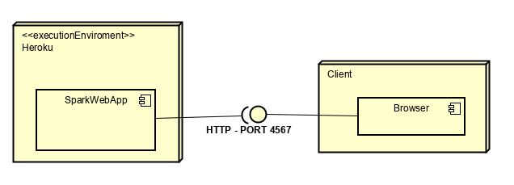

# ArepLab2
Este programa ofrece cálculos estadísticos como la media y la desviación estándar en un determinado conjunto de números
## Solución
La clase mas atomica a crear es Nodo, posee dos atributos, sig y valor, donde valor es el numero almacenado en el nodo y next es la referencia al siguiente nodo de la lista, si no lo hay es null sig. Se tiene una clase Cabeza en donde se puede hacer más fácil la referencia entre la división de los nodos entre primero y ultimo o adelante y atrás.
Se crea una clase llamada LinkedList , esta posee las funciones que harán el proceso para solucionar el problema de las listas encadenadas, en donde se evidencia las operaciones que se pueden ejecutar con este tipo de listas como es agregar un nodo, eliminar un nodo y el siguiente nodo. Main se crea para usar todas las clases para asi solucionar el problema de encontrar la media y la desviación estandar.
## Prerrequisitos
Es necesario tener instalado Java 1.8 y Apache Maven 3.6.0
## Empezando 
Para usar este programa, clone el repositorio o descargue el archivo zip del repositorio.
## Descripción
### Lista encadenada
El proyecto contiene una lista encadenada que contiene nodos y una cabeza. La cabeza da la lista tiene referencias al primer y último nodo.
Cada nodo de la lista tiene el valor que le corresponde y una referencia al siguiente nodo, en caso de que la referencia sea nula este es el último elemento de la lista.
### Operaciones
La media y la desviación estandar fueron calculadas con las fórmulas dadas en el taller.
## Ejecución de las Pruebas
Para ejecutar las pruebas, puede abrir el cmd en la carpeta de este proyecto y ejecutar.
* Compilando
```
mvn clean compile
```
* Empaquetando
```
mvn package
```
* Corriendo tests
```
mvn test
```
* Documentación
```
mvn javadoc:javadoc
```
## Diagrama de Componentes

## Proyecto
Al ejecutar debe ir a la direccion http://localhost:4567/ para probar el proyecto funcionando
## Lenguaje de Programacion
El programa esta desarrollado en el lenguaje de programación Java.

## Licencia
Esta calculadora tiene la licencia del MIT.

## Autor
- Sergio Alejandro Peña Pinto
